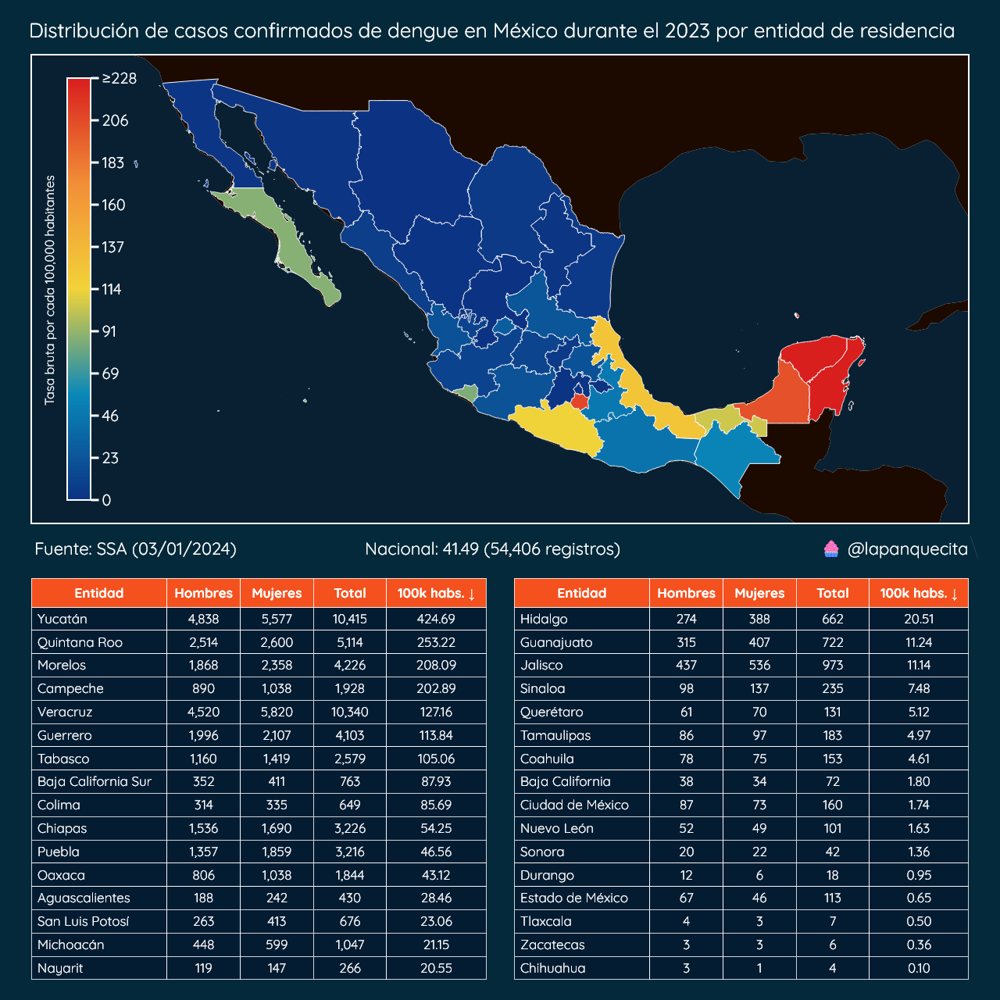
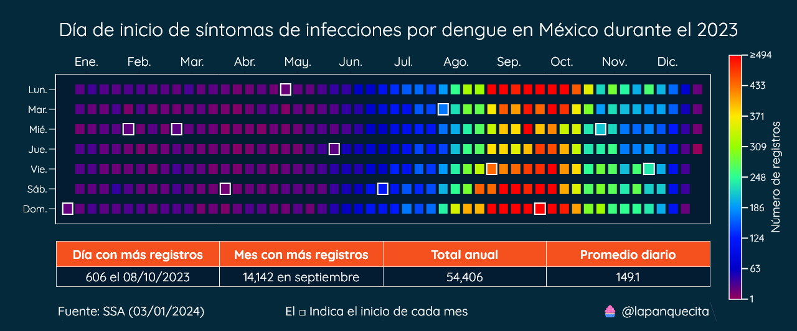

# Dengue en México

El dengue es una enfermedad viral transmitida por mosquitos, especialmente el Aedes aegypti, que es portador del virus del dengue.

Caracterizado por síntomas como fiebre alta, dolores musculares y articulares, así como erupciones cutáneas, el dengue puede variar desde casos leves hasta formas más graves que pueden poner en peligro la vida.

Este repositorio contiene los datasets y scripts para poder analizar los casos confirmados de dengue en México.

Los datos fueron recolectados del siguiente sitio web de la Secretaría de Salud:
https://www.gob.mx/salud/documentos/datos-abiertos-152127

## Distribución por entidad de residencia

Durante el 2023 la Secretaría de Salud (SSA) ha registrado al menos 54,406 casos confirmados de dengue en México.

Estos casos se concentran en la península de Yucatán, siendo el estado de Yucatán el que presenta la mayor tasa de casos confirmados por cada 100,000 habitantes (424).

Algo sobresaliente es el estado de Morelos, el cual ostenta la tercera mayor tasa por cada 100,000 habitantes (208), sin embargo no es un estado que pueda considerarse con un clima tropical.

También podemos observar que las mujeres están siendo más afectadas que los hombres, esto lo profundizaremos más adelante.

## Distribución por municipio de residencia

El mapa y tabla anteriores nos cuentan el inicio de esta historia, es momento de conocer más a detlale donde residen estas personas.

Este mapa nos muestra la tasa de incidencia para cada municipio, así como las estadísticas descriptivas.
Ahora conocemos la ubicación de los focos de infección.

En la siguiente tabla podremos consultar los 30 municipios que presentan la mayor tasa por cada 100,000 habitantes.

## Distribución según sexo y grupo de edad

El mapa por entidades nos indica que las mujeres están siendo más afectadas por esta enfermedad, sería interesante saber exactamente que grupos de edad están siendo los más afectados.

En casi todos los grupos de edad las mujeres son más afectadas que los hombres, una de las excepciones es el grupo de 10–14 años de edad, el cual coincide con ser el de mayor afectación.

Algo interesante de observar es que conforme va avanzando la edad las tasas de incidencia se van reduciendo.

Esto podría deberse a diversos factores, uno de ellos es la gravedad de los síntomas, es posible que entre más joven sea una persona, sus síntomas sean más agudos.

Cabe señalar que estos registros son de personas que manifestaban síntomas de dengue y se realizaron una prueba para determinar su condición.

## Distribución por día de inicio de síntomas

Durante el 2023 se han registrado nuevos casos de dengue todos los días, pero no al mismo ritmo.

En el siguiente calendario podremos observar como han evolucionado los nuevos casos con el paso de las semanas. Cada inicio de mes es marcado con una silueta de color blanco.

Ahora sabemos que la gran mayoría de los casos confirmados de dengue ocurren durante el verano y otoño.

## Serotipos

En la actualidad, se han descubierto 4 serotipos del virus del dengue, con un quinto en estudio.

La base de datos de la Secretaría de Salud por ahora solo contempla los primeros 4 y una categoría adicional para aquellas infecciones sin un serotipo determinado.

En estas gráficas de dona se presentan los casos confirmados y las defunciones anuales desagregados por serotipo.

En 2022, se registraron 53 defunciones por dengue en México. Al comparar esta cifra con las 203 defunciones de 2023, se observa un incremento del 283%.

En cuanto a los casos confirmados, México reportó 12,671 en 2022, mientras que en 2023 esta cifra aumentó a 54,406, lo que representa un aumento del 329%.

Este aumento es sumamente preocupante, aunque no exclusivo de México, ya que se ha observado un comportamiento similar en otros países de la región. Para la edición 2024 de este artículo se analizarán las cifras anuales para determinar si existe una tendencia y cuán fuerte es.

## Conclusión

Este breve análisis demuestra algunas técnicas comunes de exploración de datos.

Nos enfocamos en los aspectos espaciales, demográficos y temporales. Espero que el código les sea útil para sus propios análisis.
